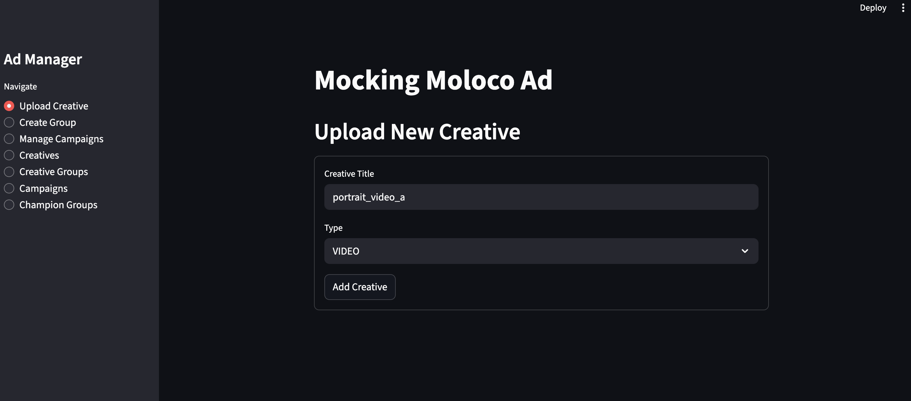
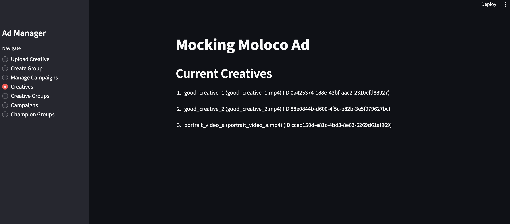
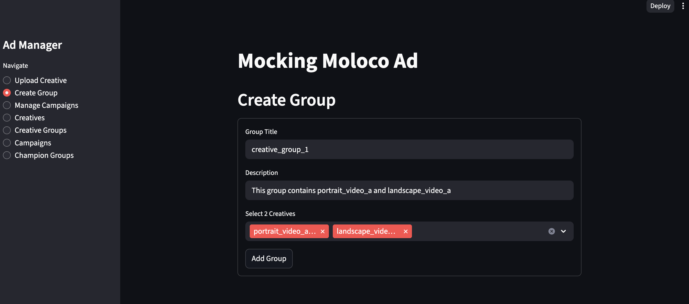
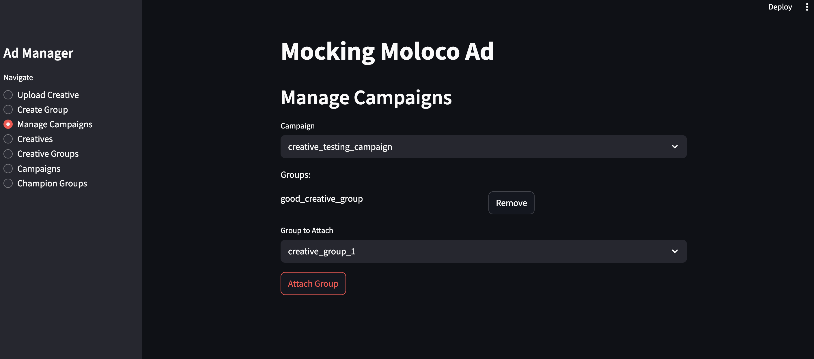
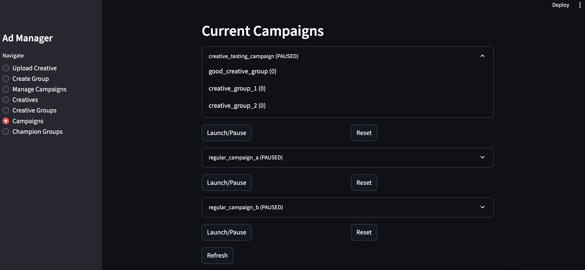
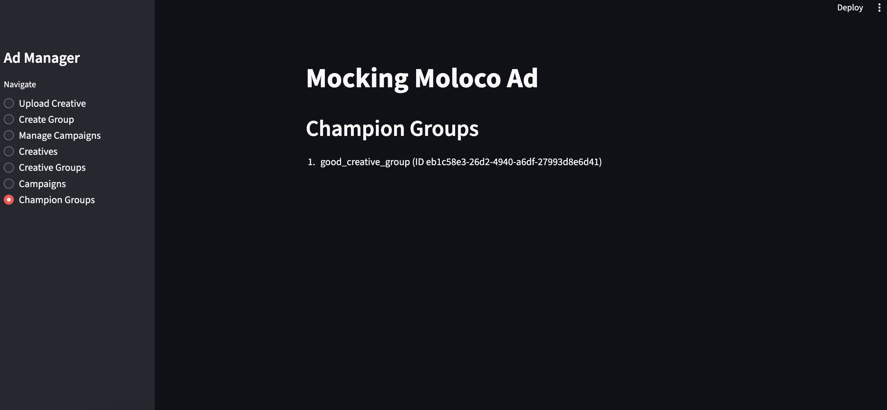

# Bubbleye_assignment
Test Project for Bubbleye


## Main Dependencies

```
python==3.13.5
fastapi==0.116.1
uvicorn==0.35.0
streamlit==1.47.1
```

## How To Run The App


1. Install Packages
    ```bash
    pip install -r requirements.txt
    ```

2. Run the server

    Under `Bubbleye_assignment` directory, run this command in a terminal
    ```bash
    python api/mock_api.py
    ```

3. Run the streamlit app

    Under `Bubbleye_assignment` directory, run this command in other terminal, and the webpage will show up.
    ```bash
    streamlit run app/streamlit_app.py
    ```

## About the App

### Upload Creatives

To upload creatives, go to the `Uploade Creative` page in the sidebar, and you can type in its title and type, and click the `Add Creative` button.



You can see the current creatives you have in the `Creatives` page by clicking the `Creatives` in the sidebar.




### Create Creative Groups
You can create creative groups in the `Create Group` page.

Type in the `Group Title`, the `Description`, and choose the creatives to attach, and click `Add Group` button.



You can see the current creative groups you have in the `Creative Groups` page by clicking the `Creative Groups` in the sidebar.


### Manage Campaigns

There are three default Campaigns `creative_testing_campaign`, `regular_campaign_a`, and `regular_campaign_b`. You are not able to create more campaigns for now, but only attach creatives to them.

To attach creative groups to a campaign, go to the `Manage Campaigns` page by clicking the `Manage Campaigns` in the sidebar, choose the target campaign in the first select box, and choose the creative gruop you want to attach in the second select box, then click the `Attach Group` button. The attached groups will appear in the middle of the two select boxes.




### Launch Campaigns

Go to the `Campaigns` page by clicking the `Campaigns` in the sidebar. You can see the campaigns you have, and see what groups each campaign has by open the expanders.

To launch or pause a campagin, click the `Launch/Pause` button under each campaign. The state will be `ACTIVE` if it's launched, and `PAUSED` if it's paused.

After launching, each group of the campaign will record the number of impressions they've recived (the number after the group names). The campaign would automatically paused after all the creative groups have recived more than 10,000 impressions. Click the `Refresh` button to refresh the page and see the latest impressions.

You can reset the impressions by clicking the `Reset` button.




### Champion Groups

After the campaign paused when all its creative groups get more than 10,000 impressions, the group with highest impressions will be added to the champion groups list for future use in the regular campaigns.




## Tests

Using Pytest for testing

1. Install packages for testing
    ```bash
    pip install -r requirement-dev.txt
    ```

2. Run the tests
    ```bash
    pytest tests/
    ```


## Future Works 

These are some works need to be done:

1. Use Pydantic BaseModel so that we can call the APIs using Request Body (json file), instead of Query Parameters.

2. Add more tests.

3. Add more function in the front end to imporve UI/UX.
